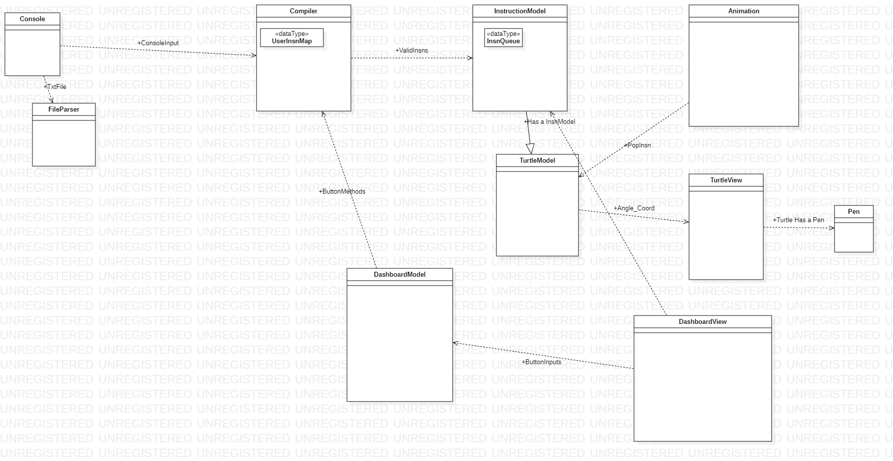

# SLogo Design Plan
### Brandon Bae, Cynthia France, Prajwal Jagadish, Thivya Sivarajah
### TEAM 01

#### Examples

Here is a graphical look at my design:

made from [a tool that generates UML from existing code](http://staruml.io/).

Here is our amazing UI:

[Link to UI on Figma](https://www.figma.com/file/Nv9FsnAwINr8tNr5HwGPbZ/SLogo-UI?node-id=0%3A1)

taken from [Brilliant Examples of Sketched UI Wireframes and Mock-Ups](https://onextrapixel.com/40-brilliant-examples-of-sketched-ui-wireframes-and-mock-ups/).

## Introduction
Our goal is to create a well-designed program that takes in user-defined commands in the form of 
.txt files and instructions from the console to create some sort of drawing. The user controls
a pen (turtle) and feeds it commands. As the turtle moves, its path is visualized, taking the form
of a picture/drawing.

The primary design goal is to make the program as flexible as possible so that new features can be
introduced with ease. In particular, we should be flexible in adding new languages, pen types, 
movement, etc., so classes that relate to these features (compiler, model(s), view(s)) should be 
open to extension. However, components that deal with the core functioning of the program (ie 
drawing, moving, reading input) should be closed for modification.

In general, the user will input commands either through the console or uploaded files that control 
how the turtle will move. From there, the commands are read and broken down into its base
components/commands. These will be executed one by one, which are visually reflected in the UI.

This continues until either the user quits or starts a new drawing, in which case the entire
process would be repeated.

## Overview

#### Controller
Internal API: FileParser
  * Parse commands, functions, and other configuration information from txt files
  * Breaks down txt file into individual strings for the Console to take care of
  * Implementations
    * support different/multiple file types
      * .txt
      * XML

External API: Console
  * Allows the user to communicate their needs to the program
  * Communicates user's commands to the compiler, which breaks down larger functions into basic
    commands, which are passed on to the InstructionModel to be executed
  * Implementations
    * Console (real-time commands and input)
    * File upload (bulk configuration/instruction)
  * In addition to creating functions and controlling the turtle's movement, the external API will 
    also give the following information back to the user when prompted: 
    * obtain turtle's location (x, y coordinates)
    * direction turtle is facing (in degrees)
    * pen status (up/down)
    * turtle viewable status (showing/hiding)
    

#### Model
Internal API
* Compiler
  * analyzes information from console to: 
    * check for errors in user commands 
    * create/keep track of user-defined functions
    * break down functions into its basic commands/components 
  * Passes on basic commands to InstructionModel
  * Implementation
    * Map -> key: function name, value: commands
    * List<Pair<String, List<String>>>
* InstructionModel
  * Keeps track of the individual commands yet to be executed
  * Feeds TurtleModel its next command when prompted
  * Implementation
    * Queue: pop the next instruction
    * Linked List

External API: TurtleModel
  * Controls the backend side of the turtle (pen status, turtle status, speed, etc.)
  * Takes in instructions from InstructionModel, executes, and updates TurtleView of its changes
  * Implementation
    * Turtle has a pen
    * Pen extends Turtle
    
#### View
Internal API: TurtleView
* Displays a visual representation of the user's commands (turtle movement, drawings, etc.)
* Updates itself according to TurtleModel's state/status
* Implementation
  * Is solely responsible for updating the "drawing pad" part of the view
  * Contains all aspects of the UI (drawing pad, buttons, etc.)
  
External API: Animation
* Puts together TurtleView's individual states to create a fluid animation/display for the user
* Implementation
  * JavaFX Timeline class
  * Some sort of internal timer/loop that calculates the time separating each frame and calls 
    TurtleView's update every time the time is correct

## User Interface

- [Link to UI on Figma](https://www.figma.com/file/Nv9FsnAwINr8tNr5HwGPbZ/SLogo-UI?node-id=0%3A1)
- Walking through the UI
  - when the user runs the program, the opening window will pop up, giving the user a chance to proceed to the main screen
  - once the user presses to blue button to continue, they have the option to upload files to create a drawing
    - on the main screen, the user also has the ability to go to the dashboard and go to controls
  - if a user decides to upload a file, the program will move to a drawing window
    - here, they can access other running drawings if they please and move back to add more files (and subsequently create more drawings)
    - they can also view and have easy access to change some variables like speed on the screen
      - these controls will be affecting the drawing as a whole
    - the user can access different drawings on the top menu and different variables on the bottom menu
  - if a user moves to the dashboard, here they can view the history of previous runs and select/edit the variables as they wish
  - if a user moves to the control, here they will get a better view of all the variables to change 
    - item 1 and item 2 are saved for future specifications
    - these controls will most likely be influencing a chosen pen, as every turtle object has a pen 
- Possible Errors
  - Much of the errors will deal with the file uploaded
    - Empty file
    - Invalid command
    - Wrong file format
  - Other errors or at least user warnings that might come in handy are a warning if the speed is past the maximum (user cannot see the drawing being created and can have the option to proceed)

## Design Details
- Controller External API
  - Console
    - Features Supported by this API:
      - Enter commands to turtle through console
      - User Sets turtle parameters (color, pen, turtle image, etc...)
    - Resources Used:
      - JavaFX (for visual display and getting input)
      - FileParser (used to handle file inputs instead of console inputs)
    - How it Serves other Components:
      - Console acts as the primary API that provides the user input for the model to work on
    - Extensions:
      - Different languages for input
      - multiple consoles for different instances of SLogo at once
    - Justification:
      - This class acts as the controller for our program. This allows for our program to have some separation between the 
      view and model which allows for further encapuslation of data and abstraction
- Controller Internal API
  - FileParser
    - Features Supported by this API:
      - Txt files with commands instead of only communicating through console
    - Resources Used:
      - File (File class used to navigate file)
      - FileChooser (allows for user to choose which files to open)
    - How it Serves other Components:
      - Translates files into string inputs which the console class is able to handle
    - Extensions:
      - Different file types beyond text files
      - C style header files
    - Justification:
      - This class acts like as an internal API for the main console external api. This internal api
      serves to provide file parsing capabilities for the console expanding its functionality. 
      - By having the file parsing functionality handled by a different internal API we allow for abstractions
      and encapsulation through the use of open closed principle, liskov substitution principle, etc...
- Model External API
  - TurtleModel
    - Features Supported by this API:
      - Turtle interactions
      - Turtle instruction execution (backend portion)
    - Resources Used:
      - InstructionModel (handles instruction ordering)
    - How it Serves other Components:
      - Handles storing and updating the variables that represent the turtle for our program
      - Works in conjunction with the TurtleView to handle all turtle functionalities
    - Extensions:
      - Different pen features (different lines, different shapes, pen offsets, etc...)
    - Justification:
      - This allows for us to better follow the single responsibility principle as it splits up the responsibility of the turtle functionality between its backend and frontend features
- Model Internal API
  - Compiler
    - Features Supported by this API:
      - see errors that result from entered commands in a user friendly way
      - User defined methods
    - Resources Used:
      - Console (gets unchecked user inputs from the console)
    - How it Serves other Components:
      - This class error checks and parses the user inputs into actual LOGO instructions which it returns for other model
      classes to utilize
    - Extensions:
      - Different coding languages
      - Logo in different languages
    - Justification:
      - Splits up responsibility of parsing user inputs into receiving input (console class) and parsing input (compiler class) 
      - We need to properly error check our code and the compiler allows for the perfect as it is the main entry point of user input
        (which can be rife with errors) and our model
  - InstructionModel
    - Features Supported by this API:
      - Line by Line instructions from the console for the turtle
    - Resources Used:
      - Queues (how instructions are stored)
      - Compiler (receives next instructions from this class)
    - How it Serves other Components:
      - Acts as an internal API for the TurtleModel by handling the ordering of a turtle instance's next instructions
    - Extensions:
      - Custom instructions in the queue
    - Justification:
      - This encapsulates the data of the instructions from the TurtleModel 
      - Further abstraction of the instruction handling which allows for potential exansion in the future
- View External API
  - Animation
    - Features Supported by this API:
      - Display turtle
      - Display variables
    - Resources Used:
      - TurtleView (turtleView handles all the turtle movements)
      - TurtleModel (to get the variables to display)
    - How it Serves other Components:
      - Combines all the backend data into a visual display for the users to see
      - Acts as an external api for the frontend to finally display the program to the user
    - Extensions:
      - multiple turtles at once
      - multiple instruction sets running at once (different grids)
    - Justification:
      - Separates frontend and backend which allows for encapsulation of sensitive data
- View Internal API
  - TurtleView
    - Features Supported by this API:
      - Display Turtle movement and pen drawings
    - Resources Used:
      - TurtleModel
    - How it Serves other Components:
      - Acts as an internal API that translates changes in turtleModel data into changes in displayed turtle
    - Extensions:
      - Turtle has multiple pens (multiple lines drawn at once)
      - Turtle reacts to each method differently (example oppositeTurtle would do the exact opposite of instruction recieved such as foward instruction making turtle go backwards)
    - Justification:
      - Splits up the responsibility of the turtle between the changing of state based off instructions (TurtleModel) and updating display (TurtleView)
      - Acts as an abstraction for the overall Animation API which allows for changes to the turtle behavior

## Design Considerations
- FileParser
  - We initially discussed having a control between FileParser and the Compiler, as it made sense to let the Compiler know if the file had gone through successfully
  - We ended up making FileParser an internal API for our Console
  - We thought this would consolidate checking the file in one area and streamline the controls between the FileParser, the Console, and the Compiler
- Pen 
  - We initially wanted to create an overarching Pen class since we didn't know how the way we would draw would change as the project specifications changed
  - We quickly realized that this was an ineffective way to structure the drawing component of our program
    - It was redundant as the turtles were the ones drawing and having a Pen parent class didn't make sense if TurtleView was supposed to be the subclass
  - In the end, we agreed to make a separate Pen object that was not involved in the hierarchy of the Turtle classes
  - We figured this way, our turtle could have a Pen object, but we could easily add onto the Pen object attributes without editing code within the Turtle classes
- TurtleModel & TurtleView
  - The design discussion above about the Pen object also affected how we created Turtle classes
  - We decided to split the Turtle into a Model and a View API
  - This was decided after looking at our overview as a whole and seeing which classes would fit into which packages
    - The turtle class(es) are perhaps the most important functionality wise to creating a drawing, but also involved a lot of backend work
    - Thus, we split up the classes to also help our team in dividing up the frontend and backend work (two people working at once in one java class would be too chaotic if we weren't partner programming)
- InstructionModel
  - In our discussion of what limitations we needed to remove from our current expectations of the project, we realized we didn't know if we would only have one element involved in the drawing
  - In the case that more than one drawing component was needed in the animation to create the drawing, we created the InstructionModel API
  - Even though this API might seem redundant if there is just one turtle controlling the animation, if there are multiple components specified, having the InstructionModel API allows for us to have these multiple components and have specific rules that allow for them to interact without error
  - Thus, in our discussion, the pros outweighed the cons in including the InstructionModel

## Test Plan

## Team Responsibilities

 * Brandon Bae: Back End (Compiler)

 * Prajwal Jagadish: Back End (Console)

 * Thivya Sivarajah: Front End

 * Cynthia France: Back End (TurtleModel)
